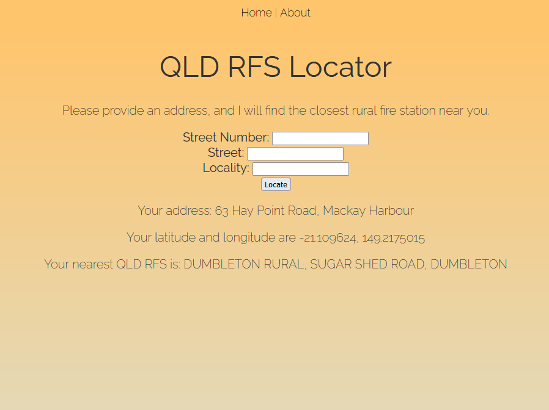

# QLD RFS Locator
Simple app to find the nearest QLD Rural Fire Station given an address.

requirements.txt contains all the dependencies needed for this to work.
You will need Python 3.12 for this to work.

qld-rfs dataset sourced from [Queensland Government Open Data Portal](https://www.data.qld.gov.au/dataset/rural-fire-stations/resource/e09d0d06-b13e-4e52-b82d-1ce0cf05927c)

TODO:
- Update qld-rfs.csv every month (automate this process)
